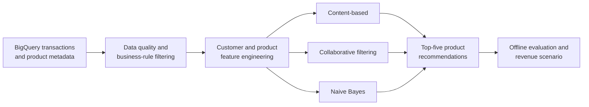

<div align="center">

# Retail Promotion Recommender System

**A data-to-decision pipeline for personalized cross-brand promotions at supermarket scale.**

[](https://www.python.org/)
[](https://cloud.google.com/bigquery)
[](https://scikit-learn.org/)
[](https://jupyter.org/)

</div>

## Overview

This project develops a personalized promotion strategy for a fictional North American supermarket. The business goal is to identify customers who purchase General Mills products and recommend relevant Kellogg's alternatives without targeting customers already buying competing private-label products.

The work combines large-scale retail data preparation, customer segmentation, product-text quality checks, feature engineering, and three recommendation approaches:

- Content-based filtering
- Collaborative filtering
- Naive Bayes classification

The repository contains the analytical notebooks and two project reports produced for the **AI & ML at Scale** course at Emory University's Goizueta Business School.

## Results at a glance

| Model | Recommendation accuracy | Transaction hit rate | Customer purchase rate |
| --- | ---: | ---: | ---: |
| Naive Bayes | 21.24% | **1.68%** | **72.64%** |
| Content-based filtering | 20.77% | 0.42% | 57.39% |
| Collaborative filtering | **25.36%** | 1.23% | 65.14% |

- **Best recommendation accuracy:** Collaborative filtering matched 25.36% of recommended products with later customer purchases.
- **Best customer coverage:** 72.64% of evaluated customers purchased at least one item from the Naive Bayes top-five recommendations.
- **Modeled business opportunity:** Applying the observed hit rate to the selected target cohort produced an estimated annual revenue opportunity of approximately **$3.27M**.
- **Product-data quality:** Expanding the TF-IDF feature space from 500 to 5,000 reduced products flagged for manual category review from **2,235 to 163**.

> [!IMPORTANT]
> The revenue figure is a model-based projection from historical analysis, not realized or experimentally validated revenue. The underlying course dataset is not included, so the published metrics have not been independently reproduced from this repository alone.

## Analytical workflow



### 1. Data understanding

- Analyzed multi-year transaction history and product metadata in BigQuery.
- Removed non-recommendable products, invalid transactions, inactive customers, and anomalous stores.
- Compared product, store, and customer performance across revenue, profit, visit, and volume measures.

### 2. Segmentation and feature engineering

- Identified General Mills customers who had not purchased the target Kellogg's products.
- Selected promising product subcategories using association confidence and business relevance.
- Engineered behavioral indicators for purchase frequency, spending, and value sensitivity.

### 3. Product-text quality

- Cleaned and tokenized product descriptions with NLTK.
- Used TF-IDF and Multinomial Naive Bayes to identify category-description mismatches.
- Combined automated screening with manual review to account for spelling variants and false positives.

### 4. Recommendation modeling

- **Content-based:** matched customer histories to product attributes using vector similarity.
- **Collaborative filtering:** modeled normalized customer-product interactions with a sparse matrix.
- **Naive Bayes:** estimated purchase propensity from engineered behavioral features.

## Evaluation

Each model generated five recommendations per customer. Performance was compared with three offline metrics:

- **Recommendation accuracy:** share of recommended products that matched later purchases.
- **Transaction hit rate:** share of transactions containing a recommended product.
- **Customer purchase rate:** share of customers purchasing at least one top-five recommendation.

Because the analysis is observational and offline, these metrics measure historical alignment rather than causal campaign lift. A production follow-up should validate the strategy with a randomized holdout experiment.

## Repository guide

| Path | Purpose |
| --- | --- |
| `Recommender System.ipynb` | Feature engineering, three recommendation models, evaluation, and revenue scenario |
| `Data Understanging & Text Mining/` | Supporting customer, product, store, and NLP analyses from the original submission |
| `Reports/Data Understanding.pdf` | Data-quality, segmentation, store/product analysis, and text-mining report |
| `Reports/Recommender System.pdf` | Modeling, evaluation, business scenario, and recommendations |

> [!NOTE]
> The directory names above currently preserve the original submission. A later cleanup will move notebooks into a consistent `notebooks/` structure while retaining Git history.

## Running the notebooks

The original notebooks query BigQuery tables that are not publicly available. To adapt the project to your own data:

1. Create a Python environment and install the required analytical packages.
2. Authenticate to Google Cloud with Application Default Credentials.
3. Provide transaction and product tables matching the schemas below.
4. Replace the `machine_learning.*` table references with your own fully qualified BigQuery tables.

Expected transaction fields include customer, store, product, transaction, date, quantity, weight, and sales amount. Expected product fields include product description, hierarchy, brand, package quantity, and unit-of-measure attributes.

Never commit a Google Cloud service-account JSON file. Prefer:

```bash
gcloud auth application-default login
```

and initialize the client with:

```python
from google.cloud import bigquery

client = bigquery.Client()
```

## Limitations and next steps

- The source data is unavailable publicly, limiting end-to-end reproducibility.
- Current evaluation is offline and does not establish incremental causal lift.
- Very sparse customer-product interactions limit transaction-level hit rates.
- The projected revenue depends on historical conversion assumptions.
- A hybrid recommender should combine collaborative-filtering accuracy with the Naive Bayes customer coverage.
- Production validation should include temporal splits, ranking metrics, calibration checks, and an A/B or geo-holdout experiment.

## Project context and attribution

This was a team project completed for Emory University's Goizueta Business School. Contributors listed in the original reports are Lanston Chen, Songbo Hu, Kedi Lin, Jie Mei, Jayson Xu, and Wenxi Xu.

The retailer and campaign scenario are presented as a case study. No proprietary source data is distributed in this repository.
